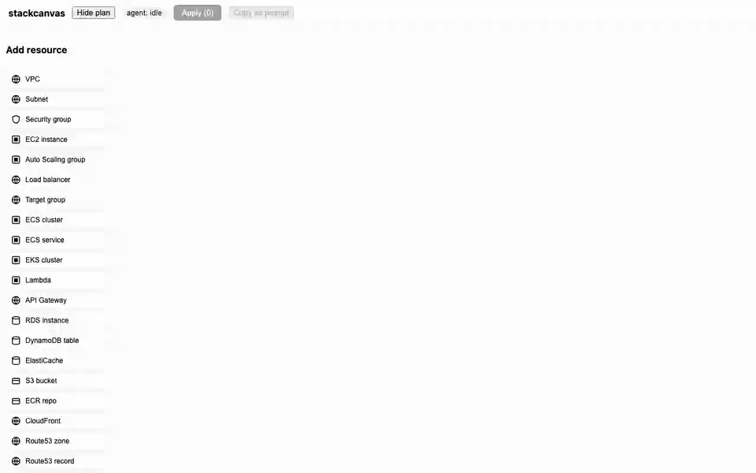

# stackcanvas

Live infrastructure canvas for AI coding agents — any agent that speaks [MCP](https://modelcontextprotocol.io) ([Claude Code](https://claude.com/claude-code) is the CI-verified path).
The agent writes and plans your Terraform — stackcanvas shows it as a living
diagram. Drag new resources onto the canvas; the agent turns them into
idiomatic HCL. No SaaS, no credentials leave your machine: everything runs on
localhost, reading your local state and plan.



## How it works

1. `open_canvas` starts a local web UI for your Terraform root.
2. The graph re-renders live whenever `*.tfstate` or `.stackcanvas/plan.json`
   change — you watch the agent work.
3. You drag resources from the palette (or right-click existing ones to
   request changes / removal) and hit **Send to agent**. Connections between two
   not-yet-created (draft) resources aren't included in the intent yet —
   connect drafts to existing resources, or describe the relation in the
   draft's wishes field.
4. The agent receives your edits as a structured intent via
   `await_canvas_intent`, writes the HCL, runs `terraform plan`, and the
   canvas highlights what will change. Only the agent executes Terraform —
   the canvas has no apply button by design.

## Install

stackcanvas is a standard MCP stdio server (`npx -y stackcanvas`) — point any
MCP-capable coding agent at it. The paths below, in order of how battle-tested
they are:

### Claude Code (CI-verified)

    claude plugin marketplace add pshenok/stackcanvas
    claude plugin install stackcanvas@stackcanvas

Then, inside a repo with Terraform:

    /stackcanvas

This is the verified path — the CI `check-plugin` job validates the plugin
and marketplace manifests on every push.

Or without the plugin system:

    claude mcp add stackcanvas -- npx -y stackcanvas

Then, inside a repo with Terraform, just ask: *open the stackcanvas canvas
for this repo*.

### Other MCP clients

The snippets below are **reported to work; not yet CI-verified** — only the
Claude Code path above is exercised in CI. Codex CLI and other MCP-capable
agents should work with the equivalent stdio config (`npx -y stackcanvas`) —
untested, reports welcome in issues.

**Cursor** (`.cursor/mcp.json`):

```json
{
  "mcpServers": {
    "stackcanvas": { "command": "npx", "args": ["-y", "stackcanvas"] }
  }
}
```

**Windsurf** (`~/.codeium/windsurf/mcp_config.json`):

```json
{
  "mcpServers": {
    "stackcanvas": { "command": "npx", "args": ["-y", "stackcanvas"] }
  }
}
```

## Multi-cloud

The canvas is provider-agnostic: **any Terraform provider in your state renders** —
AWS, GCP, Azure, Cloudflare, Datadog, `random`, all of them, in one graph
(a single Terraform root often mixes providers, so there is no "cloud switcher").
What's provider-specific is only the curation layer, shipped as **provider packs**:

- a palette pack (`packages/ui/src/resource-palette.ts`) — curated drag-and-drop types
- containment rules (`DEFAULT_CONTAINMENT_RULES` in `@stackcanvas/core`) — which
  resources render as visual containers (AWS VPC/subnet, GCP network/subnetwork,
  Azure subnet, Cloudflare zone today)
- icon patterns (`packages/ui/src/icons.tsx`)

Four packs ship today: **AWS** (complete — the reference pack) and **GCP /
Azure / Cloudflare starter packs** covering the common resource types per
provider. Rounding out a starter pack, or adding a new provider entirely, is
pure data and makes a great first PR.

## OpenTofu

stackcanvas works with [OpenTofu](https://opentofu.org) as a drop-in replacement
for Terraform: it looks for a `terraform` binary on `PATH` first, then falls
back to `tofu`. Override the choice with `--tf-bin <path>` on `stackcanvas serve`,
or set `STACKCANVAS_TF_BIN` (e.g. in your MCP client's `.mcp.json` `env` block)
to pin it — both take precedence over auto-detection.

## Tools

| Tool | Purpose |
|------|---------|
| `open_canvas` | Start the canvas for a Terraform root, open the browser |
| `load_plan` | Register a plan (JSON or binary) for diff highlighting |
| `get_graph_summary` | Text summary of the graph for the agent |
| `await_canvas_intent` | Block until the user clicks Send to agent; returns their edits |

## Demo

`examples/local-demo` is a **zero-credential** playground: `terraform init && terraform apply -auto-approve` creates real state using only local providers (no cloud account touched), and the canvas renders it — including sensitive masking on the generated password. `examples/demo` contains a small AWS config. Run `terraform init && terraform plan -out=tfplan && terraform show -json tfplan > .stackcanvas/plan.json` there and open the canvas to see create-highlighting. `plan` does not create or modify any resources — nothing is provisioned until `terraform apply` (note: the AWS provider still needs credentials and makes read-only API calls during plan).

## Telemetry

stackcanvas can send a handful of anonymous (pseudonymous install id — see
TELEMETRY.md) usage counters (installs, canvases opened, intents sent;
scan/drift counters reserved — five ever, see TELEMETRY.md) — **opt-in
only**, nothing is sent until you click **Allow** on the one-time canvas
banner, and `DO_NOT_TRACK=1` / `STACKCANVAS_TELEMETRY=0` always turn it off
regardless of that decision. No resource names, infrastructure data, or file
paths ever leave your machine. Full payload, consent model, and how to
verify it yourself: [TELEMETRY.md](TELEMETRY.md).

## Development

    pnpm install
    pnpm test          # unit + integration
    pnpm e2e           # playwright smoke
    pnpm build:pkg     # build the publishable package

## License

MIT
